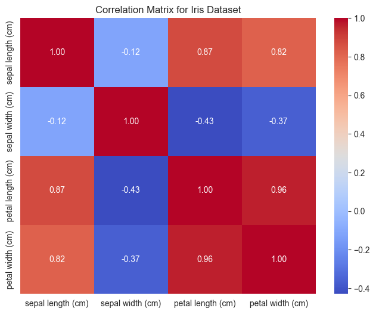
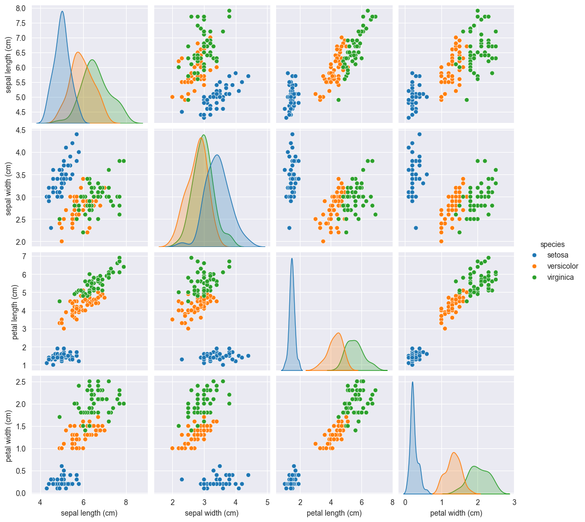

# Assignment 1 - Complete

We will be working with the `Iris Dataset` -- typically used as the `Hello world!` of machine learning projects. This dataset can be found in `sklearn datasets`. You can find the jupyter notebook for this assignment [here](https://github.com/jonivrapi/intro-to-ml/blob/main/Assignments/Assignment-1.ipynb). Find the completed assignment [here](https://github.com/jonivrapi/intro-to-ml/blob/main/Assignments/Assignment-1-completed.ipynb).

Import the dataset and do a sanity check:


```python
import pandas as pd
from sklearn.datasets import load_iris

# load the iris dataset from sklearn
iris = load_iris()

# ingest it into a dataframe specifying the data, and column names
iris_df = pd.DataFrame(iris.data, columns=iris.feature_names)
# append the target column to the dataframe
iris_df['species'] = pd.Categorical.from_codes(iris.target, iris.target_names)
# sanity check to make sure everything looks ok
iris_df.head()
```


<div>
<style scoped>
    .dataframe tbody tr th:only-of-type {
        vertical-align: middle;
    }

    .dataframe tbody tr th {
        vertical-align: top;
    }

    .dataframe thead th {
        text-align: right;
    }
</style>
<table border="1" class="dataframe">
  <thead>
    <tr style="text-align: right;">
      <th></th>
      <th>sepal length (cm)</th>
      <th>sepal width (cm)</th>
      <th>petal length (cm)</th>
      <th>petal width (cm)</th>
      <th>species</th>
    </tr>
  </thead>
  <tbody>
    <tr>
      <th>0</th>
      <td>5.1</td>
      <td>3.5</td>
      <td>1.4</td>
      <td>0.2</td>
      <td>setosa</td>
    </tr>
    <tr>
      <th>1</th>
      <td>4.9</td>
      <td>3.0</td>
      <td>1.4</td>
      <td>0.2</td>
      <td>setosa</td>
    </tr>
    <tr>
      <th>2</th>
      <td>4.7</td>
      <td>3.2</td>
      <td>1.3</td>
      <td>0.2</td>
      <td>setosa</td>
    </tr>
    <tr>
      <th>3</th>
      <td>4.6</td>
      <td>3.1</td>
      <td>1.5</td>
      <td>0.2</td>
      <td>setosa</td>
    </tr>
    <tr>
      <th>4</th>
      <td>5.0</td>
      <td>3.6</td>
      <td>1.4</td>
      <td>0.2</td>
      <td>setosa</td>
    </tr>
  </tbody>
</table>
</div>


**Question 1:** How many datapoints are in this dataset?


```python
num_datapoints = iris_df.shape[0]

print(num_datapoints)
```

    150
    

**Question 2:** How many columns (features) are there? 


```python
num_features = iris_df.shape[1]

print(num_features)
```

    5
    

**Question 3:** What are the datatypes of each feature?


```python
iris_df.dtypes
```


    sepal length (cm)     float64
    sepal width (cm)      float64
    petal length (cm)     float64
    petal width (cm)      float64
    species              category
    dtype: object


**Question 4:** What is the target feature name?

The target is the thing you are trying to predict, in the case of this assignment, that is the species.

**Question 5:** How many target categories are there?


```python
iris_df['species'].unique()
```


    ['setosa', 'versicolor', 'virginica']
    Categories (3, object): ['setosa', 'versicolor', 'virginica']


Create a correlation matrix for the features in this dataset.


```python
import seaborn as sns
import matplotlib.pyplot as plt

# Exclude the 'species' column for correlation computation because it is currently a string
numeric_columns = iris_df.select_dtypes(include=['float64', 'int64'])
correlation_matrix = numeric_columns.corr()

# Set up the matplotlib figure
plt.figure(figsize=(8, 6))

# Draw the heatmap
sns.heatmap(correlation_matrix, annot=True, cmap='coolwarm', fmt=".2f")

plt.title('Correlation Matrix for Iris Dataset')
plt.show()
```


    

    


Create a pairwise plot of all the features in this dataset.


```python
# Create a pairwise plot of the features
sns.pairplot(iris_df, hue='species')

# Show the plot
plt.show()
```


    

    


Speculate as to which features would be most useful for classification based on the above two plots.

The pairplot seems to provide the most useful information here. If you look at the charts across the diagonal of the pairplot, you will notice that (starting from the top left and going down) the first two charts have a serious amount of overlap. Since we are trying to draw (in our heads) a hyperplane to divide the target classes, you will notice that petal length vs petal width share the least amount of overlap and are therefore most easily clustered.

Set up your training and testing datasets.


```python
from sklearn.model_selection import train_test_split

# Your X matrix will contain the data that the model will learn from. This must not include the target column that you are predicting. We drop sepal width and length because of our analysis above.
X = iris_df.drop(columns=['species', 'sepal width (cm)', 'sepal length (cm)'], axis=1)

# the target variable (species) is held in your y vector and is used by the model after each training cycle to compare its predictions to the true values. This is supervised learning.
y = iris_df['species']

# Split the dataset into training set and test set with an 2/98 split. This was chosen because this is an easy dataset and all the models do every well so I wanted to show performance with a little more spread.
X_train, X_test, y_train, y_test = train_test_split(X, y, test_size=0.98, random_state=42, stratify=y)
```

Train decision tree, SVM, NB and MLP classifiers.


```python
from sklearn.tree import DecisionTreeClassifier
from sklearn.svm import SVC
from sklearn.naive_bayes import GaussianNB
from sklearn.neural_network import MLPClassifier
from sklearn.metrics import accuracy_score

# Create the models
dt_model = DecisionTreeClassifier()
svm_model = SVC()
nb_model = GaussianNB()
mlp_model = MLPClassifier(max_iter=1000)

# Train the models
dt_model.fit(X_train, y_train)
svm_model.fit(X_train, y_train)
nb_model.fit(X_train, y_train)
mlp_model.fit(X_train, y_train)
```


<style>#sk-container-id-9 {color: black;}#sk-container-id-9 pre{padding: 0;}#sk-container-id-9 div.sk-toggleable {background-color: white;}#sk-container-id-9 label.sk-toggleable__label {cursor: pointer;display: block;width: 100%;margin-bottom: 0;padding: 0.3em;box-sizing: border-box;text-align: center;}#sk-container-id-9 label.sk-toggleable__label-arrow:before {content: "▸";float: left;margin-right: 0.25em;color: #696969;}#sk-container-id-9 label.sk-toggleable__label-arrow:hover:before {color: black;}#sk-container-id-9 div.sk-estimator:hover label.sk-toggleable__label-arrow:before {color: black;}#sk-container-id-9 div.sk-toggleable__content {max-height: 0;max-width: 0;overflow: hidden;text-align: left;background-color: #f0f8ff;}#sk-container-id-9 div.sk-toggleable__content pre {margin: 0.2em;color: black;border-radius: 0.25em;background-color: #f0f8ff;}#sk-container-id-9 input.sk-toggleable__control:checked~div.sk-toggleable__content {max-height: 200px;max-width: 100%;overflow: auto;}#sk-container-id-9 input.sk-toggleable__control:checked~label.sk-toggleable__label-arrow:before {content: "▾";}#sk-container-id-9 div.sk-estimator input.sk-toggleable__control:checked~label.sk-toggleable__label {background-color: #d4ebff;}#sk-container-id-9 div.sk-label input.sk-toggleable__control:checked~label.sk-toggleable__label {background-color: #d4ebff;}#sk-container-id-9 input.sk-hidden--visually {border: 0;clip: rect(1px 1px 1px 1px);clip: rect(1px, 1px, 1px, 1px);height: 1px;margin: -1px;overflow: hidden;padding: 0;position: absolute;width: 1px;}#sk-container-id-9 div.sk-estimator {font-family: monospace;background-color: #f0f8ff;border: 1px dotted black;border-radius: 0.25em;box-sizing: border-box;margin-bottom: 0.5em;}#sk-container-id-9 div.sk-estimator:hover {background-color: #d4ebff;}#sk-container-id-9 div.sk-parallel-item::after {content: "";width: 100%;border-bottom: 1px solid gray;flex-grow: 1;}#sk-container-id-9 div.sk-label:hover label.sk-toggleable__label {background-color: #d4ebff;}#sk-container-id-9 div.sk-serial::before {content: "";position: absolute;border-left: 1px solid gray;box-sizing: border-box;top: 0;bottom: 0;left: 50%;z-index: 0;}#sk-container-id-9 div.sk-serial {display: flex;flex-direction: column;align-items: center;background-color: white;padding-right: 0.2em;padding-left: 0.2em;position: relative;}#sk-container-id-9 div.sk-item {position: relative;z-index: 1;}#sk-container-id-9 div.sk-parallel {display: flex;align-items: stretch;justify-content: center;background-color: white;position: relative;}#sk-container-id-9 div.sk-item::before, #sk-container-id-9 div.sk-parallel-item::before {content: "";position: absolute;border-left: 1px solid gray;box-sizing: border-box;top: 0;bottom: 0;left: 50%;z-index: -1;}#sk-container-id-9 div.sk-parallel-item {display: flex;flex-direction: column;z-index: 1;position: relative;background-color: white;}#sk-container-id-9 div.sk-parallel-item:first-child::after {align-self: flex-end;width: 50%;}#sk-container-id-9 div.sk-parallel-item:last-child::after {align-self: flex-start;width: 50%;}#sk-container-id-9 div.sk-parallel-item:only-child::after {width: 0;}#sk-container-id-9 div.sk-dashed-wrapped {border: 1px dashed gray;margin: 0 0.4em 0.5em 0.4em;box-sizing: border-box;padding-bottom: 0.4em;background-color: white;}#sk-container-id-9 div.sk-label label {font-family: monospace;font-weight: bold;display: inline-block;line-height: 1.2em;}#sk-container-id-9 div.sk-label-container {text-align: center;}#sk-container-id-9 div.sk-container {/* jupyter's `normalize.less` sets `[hidden] { display: none; }` but bootstrap.min.css set `[hidden] { display: none !important; }` so we also need the `!important` here to be able to override the default hidden behavior on the sphinx rendered scikit-learn.org. See: https://github.com/scikit-learn/scikit-learn/issues/21755 */display: inline-block !important;position: relative;}#sk-container-id-9 div.sk-text-repr-fallback {display: none;}</style><div id="sk-container-id-9" class="sk-top-container"><div class="sk-text-repr-fallback"><pre>MLPClassifier(max_iter=1000)</pre><b>In a Jupyter environment, please rerun this cell to show the HTML representation or trust the notebook. <br />On GitHub, the HTML representation is unable to render, please try loading this page with nbviewer.org.</b></div><div class="sk-container" hidden><div class="sk-item"><div class="sk-estimator sk-toggleable"><input class="sk-toggleable__control sk-hidden--visually" id="sk-estimator-id-9" type="checkbox" checked><label for="sk-estimator-id-9" class="sk-toggleable__label sk-toggleable__label-arrow">MLPClassifier</label><div class="sk-toggleable__content"><pre>MLPClassifier(max_iter=1000)</pre></div></div></div></div></div>


Report classification accuracies.


```python
# Make predictions
dt_predictions = dt_model.predict(X_test)
svm_predictions = svm_model.predict(X_test)
nb_predictions = nb_model.predict(X_test)
mlp_predictions = mlp_model.predict(X_test)

# Calculate and print the accuracies
dt_accuracy = accuracy_score(y_test, dt_predictions)
svm_accuracy = accuracy_score(y_test, svm_predictions)
nb_accuracy = accuracy_score(y_test, nb_predictions)
mlp_accuracy = accuracy_score(y_test, mlp_predictions)

print(f"Decision Tree Accuracy: {dt_accuracy:.2f}")
print(f"SVM Accuracy: {svm_accuracy:.2f}")
print(f"Naive Bayes Accuracy: {nb_accuracy:.2f}")
print(f"Multi-Layer Perceptron Accuracy: {mlp_accuracy:.2f}")
```

    Decision Tree Accuracy: 0.89
    SVM Accuracy: 0.84
    Naive Bayes Accuracy: 0.84
    Multi-Layer Perceptron Accuracy: 0.88
    
