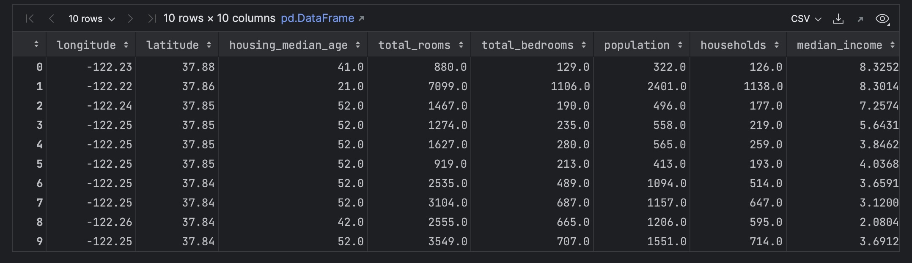
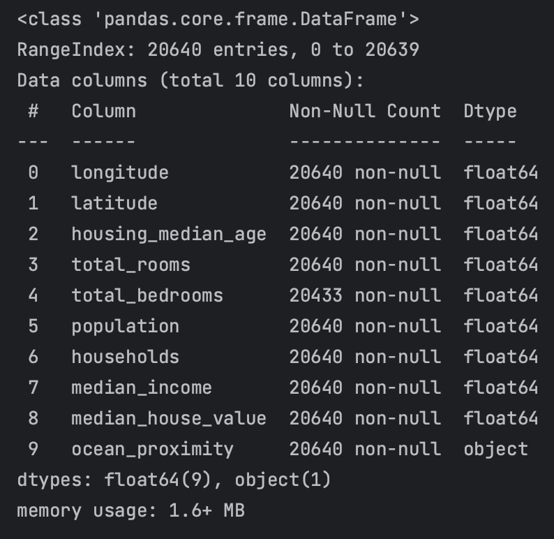
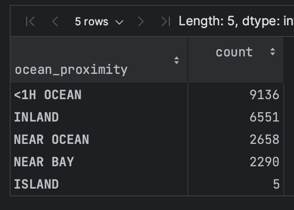
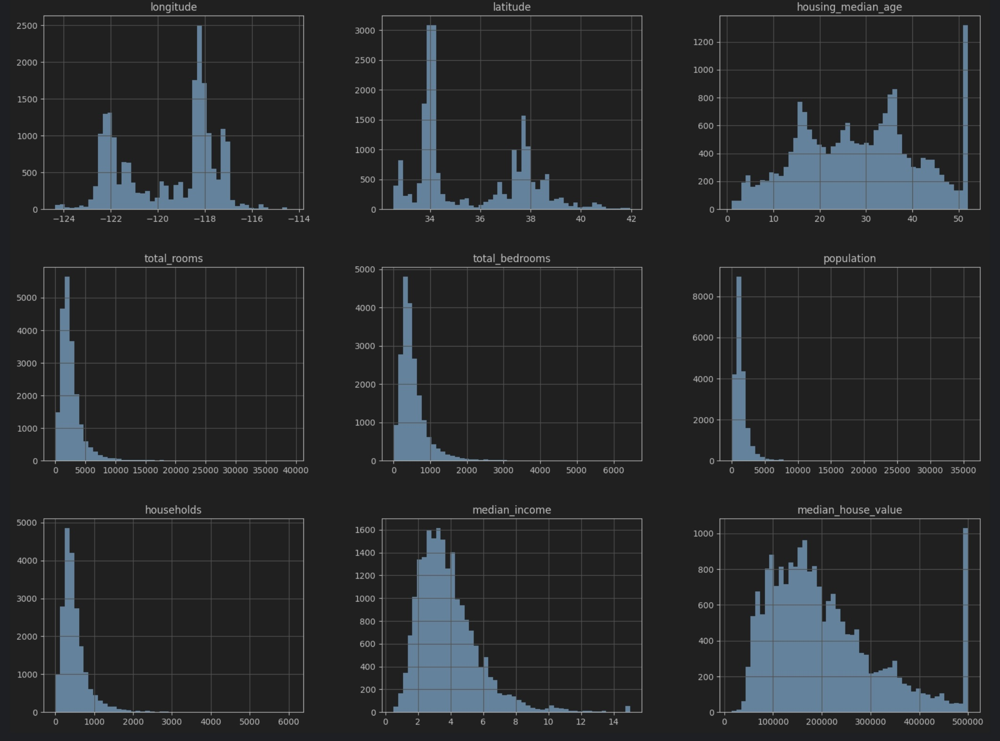
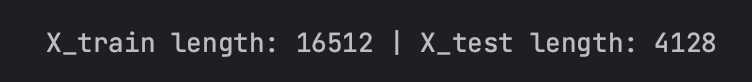

# End-to-End ML Project

In this article, we will work through a simple end-to-end ML project based on Chapter 2 of *Hands-On Machine learning with Scikit-Learn and TensorFlow* by Aurélien Géron to give you a taste for how this works in practice. It will closely follow the following structure:

1. Frame the Problem
2. Get data
3. Analyze the data to gain insights about the problem
4. Preprocess the data for ML
5. Choose a model(s) to test
6. Train the model(s)
7. Evaluate the model(s)
8. Choose a model
9. Tune the model's hyperparameters


### California Housing Data

While there are many toy datasets that you can play with to practice your ML skill set, it is always best to try and work with real data as this is more representative of what you will have to deal with in your day job. Data is never clean, always hard to find, and almost never complete. With that in mind, we will be using the California Housing Prices dataset which you can download here:

This dataset comes from [Kaggle](https://www.kaggle.com/datasets/camnugent/california-housing-prices?resource=download) and has the following explanation:

> **Context**
> 
>This is the dataset used in the second chapter of Aurélien Géron's recent book 'Hands-On Machine learning with Scikit-Learn and TensorFlow'. It serves as an excellent introduction to implementing machine learning algorithms because it requires rudimentary data cleaning, has an easily understandable list of variables and sits at an optimal size between being to toyish and too cumbersome.
>
>The data contains information from the 1990 California census. So although it may not help you with predicting current housing prices like the Zillow Zestimate dataset, it does provide an accessible introductory dataset for teaching people about the basics of machine learning.
>
> **Content**
>
>The data pertains to the houses found in a given California district and some summary stats about them based on the 1990 census data. Be warned the data aren't cleaned so there are some preprocessing steps required! The columns are as follows, their names are pretty self explanitory:
>
>longitude
>
>latitude
>
>housing_median_age
>
>total_rooms
>
>total_bedrooms
>
>population
>
>households
>
>median_income
>
>median_house_value
>
>ocean_proximity


The purpose of this project is to ultimately end up with a model that is able to predict the median house price in any district, give all the other metrics.

### Framing the Problem

The first thing you should do is to ask what the business objective is. This will determine many facets of how you approach the problem, such as which performance measures you choose, which algorithms you select, and how much time you will spend optimizing hyperparameters.

After asking how the model is expected to be used, you are told that this model's output is expected to be fed into another ML system as one signal among many, whose purpose is to predict whether it is worth investing in a given area or not. Cool. 

The next question you may ask would be how this process is currently done. You determine that the process is currently manual, and a team of SME's gathers the most recent information about a district, and then uses a complex rule-set to estimate a price. This takes a huge amount of time, and the estimates are mediocre. 

Now, given what you have read in previous sections, is this a supervised, unsupervised, or RL problem? Is it a Classification task, or a Regression task? Upon looking at the explanation of the data above, you can see that the median house value is present, making this a textbook supervised learning task. In addition, since you are attempting to predict a continuous value, it is a regression task. Finally, since we are using multiple features to predict this continuous value, it is a *multiple* regression task. Finally, since we are only trying to predict a single value, it will be a *univariate regression* problem.

### Selecting a Performance Measure

A typical performance measure for regression problems is the Root Mean Squared Error (RMSE). This is a way, as with the Mean Absolute Error (MAE), to measure the distance between two vectors -- in our case, the vector of predictions and the vector of target values. It is defined as follows:

$$
    RMSE(\mathbf{X}, h) = \sqrt{\frac{1}{m} \sum_{i=1}^{m} h( \mathbf{x^{(i)}} - y^{(i)} )^2}
$$

Where

- $m$ is the number of instances in your dataset that you are measuring RMSE on
- $\mathbf{x^{(i)}}$ is the vector of all feature values excluding the label of the $i$th instance (row) in the dataset
- $y^{(i)}$ is $x^{(i)}$'th's label
- $h$ is your system's prediction function, also called your *hypothesis*. If given $\mathbf{x^{(i)}}$ it outputs $\hat{y^{(i)}} = h(\mathbf{x^{(i)}})$.

RMSE corresponds to the *Euclidean norm*, and is also referred to as the $L_2$ norm and is denoted as $\|x\|_2$. MAE corresponds to the *Manhattan norm* and is referred to as the $L_1$ norm and denoted $\|x\|_1$.

### Getting the data
In our case, you will get the data from here:

[!file](./datasets/housing.csv)

### Analyze the data
Next, we will perform some analysis of the data so that we can get a better handle on it. This part of the ML development process is extremely important as it is where you will garner the vast majority of insights you develop from working with your dataset. This will help inform your model development later on.

Let's begin by doing a sanity check of our data.

```python
import pandas as pd

df = pd.read_csv('housing.csv')

df.head(10)
```


Next, let's try and get an understanding of how much data we have, and how much of it may be missing.

```python
df.info()
```


Here you will notice that there are 20,640 total observations in the dataset, and that all columns except for `total_bedrooms` have 20,640 rows. `total_bedrooms` seems to be missing 207 values...which we will handle later. Another important thing to notice here is that all values are numerical, except for `ocean_proximity` which is of type `object` (in this case a string). It is therefore a categorical feature, and you can inspect the categories and their counts like so:

```python
df['ocean_proximity'].value_counts()
```


Finally, another useful thing to do is to plot your numerical values with a histogram. This can help to visually reveal the distributions and scales of your numerical features which can inform preprocessing steps and model selection down the line.

```python
%matplotlib inline

import matplotlib.pyplot as plt
df.hist(bins=50, figsize=(20, 15))
plt.show()
```


You may notice here that many of your features are on different scales. This is also a problem that we will handle later on. Many models require that your input features be on the same scale lest they potentially may learn that one feature is more important than another, simply because its values are larger.

### Splitting your data

When a model "learns", what it is really learning are the proper values to assign to the parameters in its model. The model is essentially fitting a curve to your dataset. There is a caveat here in that not all models are fitting a curve, but these will be discussed later.

With that being said, when training a model, it is important to ensure that you do not evaluate the performance of your model on the same data that was used to train it. Implicitly, when the model learn the values of the parameters required to fit your data, it is in a sense memorizing something about your data's distribution. Therefore, it is necessary to split your data into training and testing sets. The training set to be used to train your model, and the testing set to be used to evaluate its performance. 

One way to split your data is as follows:

```python
from sklearn.model_selection import train_test_split

X = df.drop(columns=['median_house_value'])
y = df['median_house_value']

X_train, X_test, y_train, y_test = train_test_split(X, y, test_size=0.2, random_state=42)

print(f'X_train length: {len(X_train)} | X_test length: {len(X_test)}')
```


Here we begin by defining our $\mathbf{X}$ set (our set of input features) and our $y$ set (our set of target values to be predicted). We then use `sklearn`'s built in `train_test_split` function to split our data into 80% training data, and 20% testing data. These values were arbitrarily chosen based on the small size of the dataset. If you had millions of samples, it may be perfectly reasonable to train on 99% of your data and test only on 1% of it.

### Further Data Exploration

Now that you have split out your training and testing sets, you can do some more exploration of the data