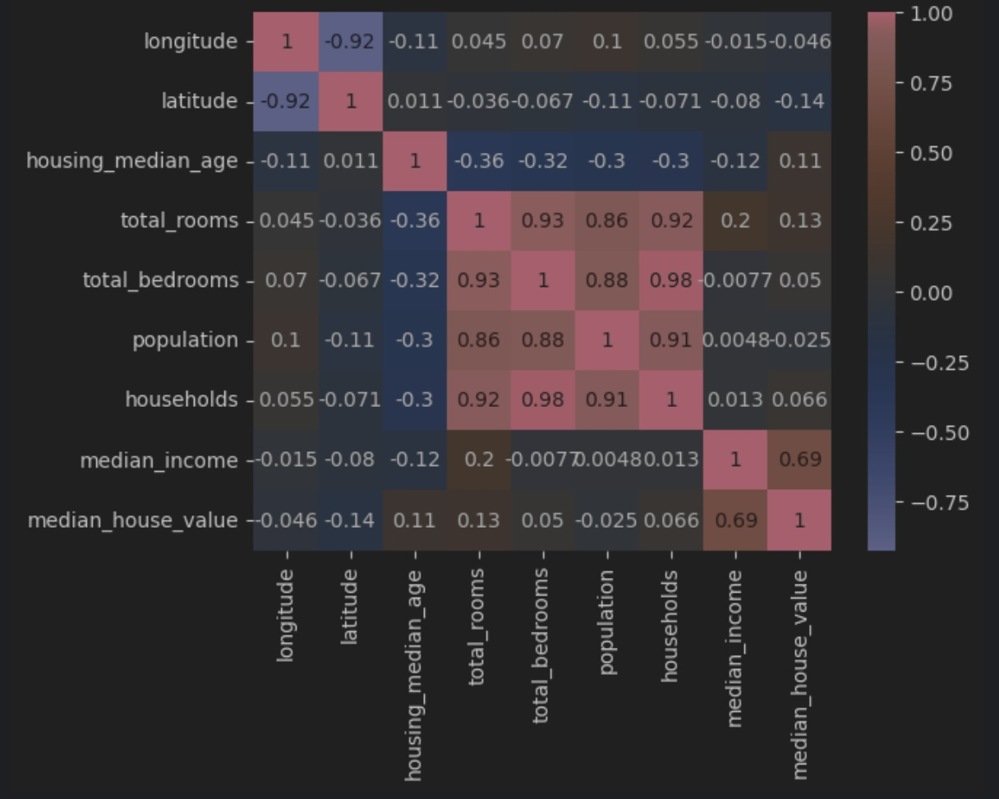
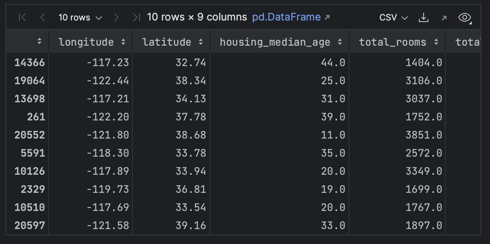
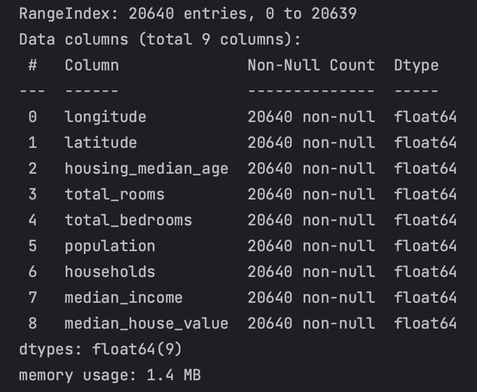

# End-to-End ML Project

In this article, we will work through a simple end-to-end ML project based on Chapter 2 of *Hands-On Machine learning with Scikit-Learn and TensorFlow* by Aurélien Géron to give you a taste for how this works in practice. It will closely follow the following structure:

1. Frame the Problem
2. Choosing a Performance Measure
3. Analyze the data to gain insights about the problem
4. Preprocess the data for ML
5. Choose a model to test
6. Train the model
7. Evaluate the model


### California Housing Data

While there are many toy datasets that you can play with to practice your ML skill set, it is always best to try and work with real data as this is more representative of what you will have to deal with in your day job. Data is never clean, always hard to find, and almost never complete. With that in mind, we will be using the California Housing Prices dataset which you can download here:

[!file housing.csv](./datasets/housing.csv)

This dataset comes from [Kaggle](https://www.kaggle.com/datasets/camnugent/california-housing-prices?resource=download) and has the following explanation:

> **Context**
> 
>This is the dataset used in the second chapter of Aurélien Géron's recent book 'Hands-On Machine learning with Scikit-Learn and TensorFlow'. It serves as an excellent introduction to implementing machine learning algorithms because it requires rudimentary data cleaning, has an easily understandable list of variables and sits at an optimal size between being too toyish and too cumbersome.
>
>The data contains information from the 1990 California census. So although it may not help you with predicting current housing prices like the Zillow Zestimate dataset, it does provide an accessible introductory dataset for teaching people about the basics of machine learning.
>
> **Content**
>
>The data pertains to the houses found in a given California district and some summary stats about them based on the 1990 census data. Be warned the data aren't cleaned, so there are some preprocessing steps required! The columns are as follows, their names are pretty self-explanatory:
>
>longitude
>
>latitude
>
>housing_median_age
>
>total_rooms
>
>total_bedrooms
>
>population
>
>households
>
>median_income
>
>median_house_value
>
>ocean_proximity


The purpose of this project is to ultimately end up with a model that is able to predict the median house price in any district, give all the other metrics.

### Framing the Problem

The first thing you should do is to ask what the business objective is. This will determine many facets of how you approach the problem, such as which performance measures you choose, which algorithms you select, and how much time you will spend optimizing hyperparameters.

After asking how the model is expected to be used, you are told that this model's output is expected to be fed into another ML system as one signal among many, whose purpose is to predict whether it is worth investing in a given area or not. Cool. 

The next question you may ask would be how this process is currently done. You determine that the process is currently manual, and a team of SME's gathers the most recent information about a district, and then uses a complex rule-set to estimate a price. This takes a huge amount of time, and the estimates are mediocre. 

Now, given what you have read in previous sections, is this a supervised, unsupervised, or RL problem? Is it a Classification task, or a Regression task? Upon looking at the explanation of the data above, you can see that the median house value is present, making this a textbook supervised learning task. In addition, since you are attempting to predict a continuous value, it is a regression task. Finally, since we are using multiple features to predict this continuous value, it is a *multiple* regression task. Finally, since we are only trying to predict a single value, it will be a *univariate regression* problem.

### Selecting a Performance Measure

A typical performance measure for regression problems is the Root Mean Squared Error (RMSE). This is a way, as with the Mean Absolute Error (MAE), to measure the distance between two vectors -- in our case, the vector of predictions and the vector of target values. It is defined as follows:

$$
    RMSE(\mathbf{X}, h) = \sqrt{\frac{1}{m} \sum_{i=1}^{m} h( \mathbf{x^{(i)}} - y^{(i)} )^2}
$$

Where

- $m$ is the number of instances in your dataset that you are measuring RMSE on
- $\mathbf{x^{(i)}}$ is the vector of all feature values excluding the label of the $i$th instance (row) in the dataset
- $y^{(i)}$ is $x^{(i)}$'th's label
- $h$ is your system's prediction function, also called your *hypothesis*. If given $\mathbf{x^{(i)}}$ it outputs $\hat{y^{(i)}} = h(\mathbf{x^{(i)}})$.

RMSE corresponds to the *Euclidean norm*, and is also referred to as the $L_2$ norm and is denoted as $\|x\|_2$. MAE corresponds to the *Manhattan norm* and is referred to as the $L_1$ norm and denoted $\|x\|_1$.

### Getting the data
In our case, you will get the data from here:

[!file](./datasets/housing.csv)

### Analyze the data
Next, we will perform some analysis of the data so that we can get a better handle on it. This part of the ML development process is extremely important as it is where you will garner the vast majority of insights you develop from working with your dataset. This will help inform your model development later on.

Let's begin by doing a sanity check of our data.

```python
import pandas as pd

df = pd.read_csv('housing.csv')

df.head(10)
```


Next, let's try and get an understanding of how much data we have, and how much of it may be missing.

```python
df.info()
```


Here you will notice that there are 20,640 total observations in the dataset, and that all columns except for `total_bedrooms` have 20,640 rows. `total_bedrooms` seems to be missing 207 values...which we will handle later. Another important thing to notice here is that all values are numerical, except for `ocean_proximity` which is of type `object` (in this case a string). It is therefore a categorical feature, and you can inspect the categories and their counts like so:

```python
df['ocean_proximity'].value_counts()
```


Finally, another useful thing to do is to plot your numerical values with a histogram. This can help to visually reveal the distributions and scales of your numerical features which can inform preprocessing steps and model selection down the line.

```python
%matplotlib inline

import matplotlib.pyplot as plt
df.hist(bins=50, figsize=(20, 15))
plt.show()
```


You may notice here that many of your features are on different scales. This is also a problem that we will handle later on. Many models require that your input features be on the same scale lest they potentially may learn that one feature is more important than another, simply because its values are larger.

### Further Data Exploration

We did a basic exploration of the data earlier on this page, and will follow up with slightly more here. The purpose of this section is to keep this whole process as simple as possible to give you an idea for how you might approach things, but remember that there are a LOT of things you can do to explore your data to look for patterns.

The following is an example of how to create a correlation matrix so you are able to see how correlated your features are. This only works with numerical features and for brevity's sake, we excluded the categorical features. There are, however, many ways to handle categorical features will be discussed in a future section.

```python
import seaborn as sns
import matplotlib.pyplot as plt
import numpy as np

numeric_data = df.select_dtypes(include=[np.number])
correlation_matrix = numeric_data.corr()

sns.heatmap(correlation_matrix, annot=True, cmap='coolwarm')
plt.show()
```


In reading this chart, a value of `1` indicates a perfect correlation, a value of `0` indicates no correlation, and a value of `-1` indicates a perfect negative correlation. Reading this chart, we can see that there is a high correlation between `total_rooms` and `total_bedrooms` (which makes sense) as well as between `total_rooms` and `households` and `population`. Likewise, there is a high correlation between `households` and `population`. The rest of the numerical features seem to have insignificant correlations. Finally, we can also see that `median_income` is pretty highly correlated to `median_house_value` (which is our target). Now, what are you to do with this information?

Well, highly correlated variables can help guide you in your feature selection process. You do not typically want to use many very highly correlated features together as they can reduce the performance of regression models due to multicollinearity. By dropping some of these features, you also may be able to improve a model's predictive performance as well as its compute performance. When features are highly correlated with your target variable, however, this is an indication that they may hold good predictive power. Remember that this matrix is only showing *linear* correlations. It completely ignores non-linear relationships which are powerful as well.


### Handling Missing Values

Next, in order to prep our data for the model, we should first handle any missing values. Let's check if there are any first by reviewing the dataframe info output [here](#analyze-the-data). You will notice that `total_bedrooms` seems to have 217 rows with missing values. One way to handle this is to *impute* missing values. You can impute missing values in a whole host of different ways, the simplest of which are just to fill them with the mean or median of the values in the column. In thinking about the field `total_bedrooms`, would the median or the mean be the best solution for imputing missing values here? Considering the mean would likely be a floating point number, and that 3.25 bedrooms doesn't make sense, the median is likely the better option here. Lets see what that looks like:

```python
from sklearn.impute import SimpleImputer

imputer = SimpleImputer(strategy='median')
imputer.fit(X_train)

X_train_imputed = imputer.transform(X_train)
X_test_imputed = imputer.transform(X_test) # for use later

imputed_df = pd.DataFrame(X_train_imputed, columns=X_train.columns)

imputed_df.sample(10)
```


Here, we instantiate a `SimpleImputer` and give it a strategy. We then fit this imputer and use it to transform the training and testing dataframes to impute the missing values. Finally, as the result of the `transform` is a `numpy` array, we convert it back to a dataframe for easier viewing and manipulation. We can now sanity-check that we did, in fact, solve our nulls issue by rerunning the info command.

> Note: It is important to remember that you can only fit the scalars, or any kind of transformation, to the training set in order to prevent *data leakage*.

```python
imputed_df.info()
```



# Training a Model

The first step in training a model is of course selecting the model. To keep things simple, here we will choose a simple `LinearRegression` model from `sklearn`.

```python
from sklearn.linear_model import LinearRegression
from sklearn.metrics import mean_squared_error

regressor = LinearRegression()
regressor.fit(X_train_imputed, y_train)

predictions = regressor.predict(X_test_imputed)

mse = mean_squared_error(y_test, predictions)
rmse = np.sqrt(mse)

print(f"This model's predictions are off by ${rmse:.2f}")
```


We fit the model to our training data, then made predictions on our test data, then evaluated those predictions with our chosen performance measure, and achieved a model which is off by about $71,000 per housing price prediction. This is obviously not good, but for our first end-to-end ML project, not bad!