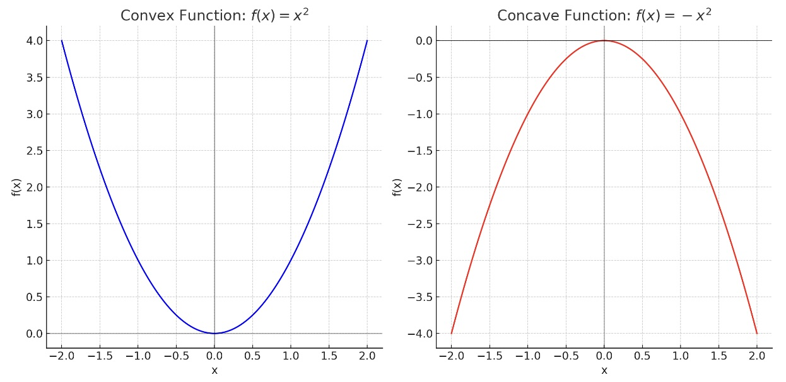

# A (not) exhaustive collection of the mathematical concepts related to ML

### Notation
A note on typical ML mathematical notation:

- Lowercase bold face font is used to refer to vectors $\mathbf{x^{(i)}}$ where $\mathbf{x}$ is the vector of values at the $i$'th row.
- Uppercase $\mathbf{X}$ is used to signify a matrix.

### Mean (Average)

The mean is the sum of all values divided by the number of values.

$$
    \bar{x} = \frac{1}{N} \sum_{i=1}^{N} x_i
$$

Where $N$ is the number of observations and $x_i$ is each individual observation.

### Median

The median is the middle value in a data set when the values are arranged in ascending or descending order.

### Mode

The mode is the most frequently occurring value in a data set.

### Standard Deviation

Standard deviation measures the amount of variation or dispersion in a set of values.

$$
    \sigma = \sqrt{\frac{1}{N} \sum_{i=1}^{N} (x_i - \mu)^2}
$$

Where $\mu$ is the mean.

### Normal Distribution

The normal distribution is also known as the Gaussian distribution.

$$
    f(x) = \frac{1}{\sqrt{2\pi\sigma^2}} e^{ -\frac{(x-\mu)^2}{2\sigma^2} }
$$

Where $\mu$ is the mean and $\sigma^2$ is the variance.

### Binomial Distribution

The binomial distribution represents the number of successes in a sequence of independent experiments.

$$
    P(k) = \binom{n}{k} p^k (1-p)^{n-k}
$$

Where $n$ is the number of trials, $p$ is the probability of success, and $k$ is the number of successes.

### Pearson Correlation

Correlation measures the strength and direction of a linear relationship between two variables.

$$
    r_{xy} = \frac{\sum_{i=1}^{N} (x_i - \bar{x})(y_i - \bar{y}) }{\sqrt{\sum_{i=1}^{N} (x_i - \bar{x})^2 \sum_{i=1}^{N} (y_i - \bar{y})^2}}
$$

Where $\bar{x}$ and $\bar{y}$ are the means of the two variables. A score of $1$ would indicate a perfect correlation and that high values of $x$ correspond with high values of $y$. A score or $-1$ would indicate a perfect inverse correlation and that high values of $x$ correspond with low values of $y$. A score of $0$ would indicate no correlation and that a change in $x$ does not correspond with a change in $y$.

### Covariance

Covariance indicates the direction of the linear relationship between variables.

For a **population**: $$ \text{Cov}(x, y) = \frac{1}{N} \sum_{i=1}^{N} (x_i - \bar{x})(y_i - \bar{y}) $$

For a **sample**: $$ \text{Cov}(x, y) = \frac{1}{N-1} \sum_{i=1}^{N} (x_i - \bar{x})(y_i - \bar{y}) $$

Where $\bar{x}$ and $\bar{y}$ are the means of the variables $x$ and $y$, respectively.

### Z-test

Used when the data follows a normal distribution, and the population variance is known.

$$
    Z = \frac{\bar{x} - \mu}{\frac{\sigma}{\sqrt{n}}}
$$

Where $\bar{x}$ is the sample mean, $\mu$ is the population mean, $\sigma$ is the population standard deviation, and $n$ is the sample size.

### 1-Sample T-test

Used when the population variance is unknown.

$$
    t = \frac{\bar{x} - \mu}{\frac{\sigma}{\sqrt{n}}}
$$

Where $\bar{x}$ is the sample mean, $\mu$ is the population mean, $\sigma$ is the population standard deviation, and $n$ is the sample size.

### Linear Regression

In linear regression, we model the relationship between two variables by fitting a linear equation to observed data. The formula for a simple linear regression is:

$$
    Y_i = \beta_0 + \beta_1 X_i + \epsilon
$$

Where $Y$ is the dependent variable, $X$ is the independent variable, $\beta_0$ is the y-intercept, $\beta_1$ is the slope of the line, and $\epsilon$ is the error term.

### Multiple Regression

Multiple regression is an extension of linear regression into a relationship with more than one independent variable:

$$
    Y = \beta_0 + \beta_1 X_1 + \beta_2 X_2 + \dots + \beta_n X_n + \epsilon
$$

### Bayes' Theorem

Bayes' Theorem is fundamental to Bayesian statistics:

$$
    P(A|B) = \frac{P(B|A) \times P(A)}{P(B)}
$$

Where $P(A|B)$ is the probability of $A$ given $B$, and $P(B|A)$ is the probability of $B$ given $A$.

### Entropy

Entropy is a measure of randomness or uncertainty.

$$
    H(X) = - \sum_{i=1}^{n} P(x_i) \log_2 P(x_i)
$$

Where $H(X)$ is the entropy of a random variable $X$ and $P(x_i)$ is the probability of each outcome.

### Univariate Regression

Univariate regression is a statistical technique used to model and analyze the relationship between a single independent variable $x$ and a dependent variable $y$. It aims to fit a linear model to the data, typically represented as $y = mx + b$, where $m$ is the slope and $b$ is the y-intercept. The goal is to find the best-fitting line through the data points that minimizes the differences (residuals) between the observed values and the values predicted by the model.

### Multivariate Regression

Multivariate regression is a statistical technique used to model the relationship between two or more independent variables $x₁, x₂, ..., xₙ$ and a dependent variable $y$. It aims to fit a linear model to the data, typically represented as $y = b₀ + b₁x₁ + b₂x₂ + ... + bₙxₙ$, where $b₀$ is the intercept and $b₁, b₂, ..., bₙ$ are the coefficients of the independent variables. The goal is to find the coefficients that best predict the dependent variable, minimizing the difference between the observed values and the model's predictions, often using methods like least squares.

### Multicollinearity

**Multicollinearity** is a statistical phenomenon in which two or more predictor variables in a multiple regression model are highly correlated, meaning that one predictor variable can be linearly predicted from the others with a substantial degree of accuracy. In a more rigorous context, multicollinearity refers to the situation where the design matrix $X$ in a regression model has some approximate or exact linear dependencies among its columns.

Here's a more formal definition:

In the context of a multiple regression model, the model can be represented as:

$$
    Y = \beta_0 + \beta_1 X_1 + \beta_2 X_2 + ... + \beta_k X_k + \epsilon
$$

where:
- $ Y $ is the dependent variable.
- $ X_1, X_2, ..., X_k $ are the independent (predictor) variables.
- $ \beta_0, \beta_1, ..., \beta_k $ are the coefficients of the model.
- $ \epsilon $ is the error term.

Multicollinearity is present when:

$$
    X_j = \alpha_0 + \alpha_1 X_1 + ... + \alpha_{j-1} X_{j-1} + \alpha_{j+1} X_{j+1} + ... + \alpha_k X_k + \nu
$$

for some predictor variable $ X_j $ (where $ j $ is between 1 and $ k $), with a high degree of accuracy (i.e., the variance of $ \nu $, the error term, is small).

In this situation, the matrix $ X^TX $ (where $ X $ is the design matrix of predictor variables) becomes close to singular (or actually singular in the case of perfect multicollinearity), meaning that its determinant is close to zero or exactly zero. This causes problems in estimating the coefficients $ \beta_i $ using ordinary least squares (OLS) as the inverse of $ X^TX $ (required in OLS estimation) does not exist or is poorly conditioned.

Consequences of multicollinearity include:

1. Inflated variances of the estimated coefficients, leading to wider confidence intervals and less reliable statistical tests.
2. Difficulty in determining the individual effect of correlated predictors on the dependent variable.
3. Unstable estimates of the coefficients, where small changes in the model or the data can lead to large changes in the coefficient estimates.

Detecting multicollinearity typically involves looking at correlation matrices, variance inflation factors (VIF), or condition indices.

### Variance

**Variance** is a statistical measure that quantifies the spread or dispersion of a set of data points. It is used to represent how far each number in the dataset is from the mean and thus from every other number in the set. In more technical terms, variance measures the average squared deviations from the mean of the data points.

Formally, the variance of a random variable $X$ is defined as the expected value of the squared deviation of $X$ from its mean $\mu$, denoted as $\text{Var}(X)$ or $\sigma^2$. Mathematically, it is expressed as:

$$
    \text{Var}(X) = E[(X - \mu)^2]
$$

where:
- $E$ is the expected value operator.
- $X$ is a random variable.
- $\mu$ is the mean of $X$.

For a finite set of data points $x_1, x_2, ..., x_n$, the sample variance is calculated as:

$$
    s^2 = \frac{1}{n-1} \sum_{i=1}^{n} (x_i - \bar{x})^2
$$

where:
- $s^2$ is the sample variance.
- $x_i$ are the individual data points.
- $\bar{x}$ is the sample mean.
- $n$ is the number of data points.

The factor $n-1$ in the denominator is used for an unbiased estimate of the variance in the case of a sample (this is known as Bessel's correction). If the entire population is used, the denominator becomes $n$.

Variance is a foundational concept in statistics, providing a measure of the variability or spread in a set of data. A low variance indicates that the data points tend to be very close to the mean and hence to each other, while a high variance indicates that the data points are spread out over a wider range of values.

### Convex Functions
A function $f(x)$ is called convex on an interval if the line segment between any two points on the graph of the function lies above or on the graph. Formally, a function $f: I \rightarrow \mathbb{R}$ (where $I$ is an interval) is convex if, for any two points $x_1, x_2 \in I$ and any $\lambda$ such that $0 \leq \lambda \leq 1$, the following inequality holds:

$$
    f(\lambda x_1 + (1 - \lambda) x_2) \leq \lambda f(x_1) + (1 - \lambda) f(x_2)
$$

In simpler terms, this means that the function curves downwards, or has an upward-facing curvature. Examples include the function $f(x) = x^2$ or $f(x) = e^x$. A twice-differentiable function is convex on an interval if its second derivative is non-negative throughout that interval.

### Concave Functions
A function is concave on an interval if the line segment between any two points on the graph of the function lies below or on the graph. Formally, a function $f: I \rightarrow \mathbb{R}$ is concave if, for any two points $x_1, x_2 \in I$ and any $\lambda$ such that $0 \leq \lambda \leq 1$, the following inequality holds:

$$
    f(\lambda x_1 + (1 - \lambda) x_2) \geq \lambda f(x_1) + (1 - \lambda) f(x_2)
$$

This means that the function curves upwards, or has a downward-facing curvature. Examples include $f(x) = \log(x)$ or $f(x) = -x^2$. A twice-differentiable function is concave on an interval if its second derivative is non-positive throughout that interval.

