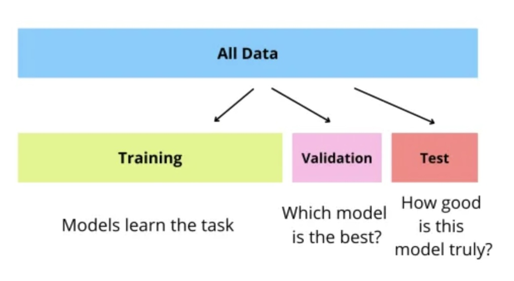
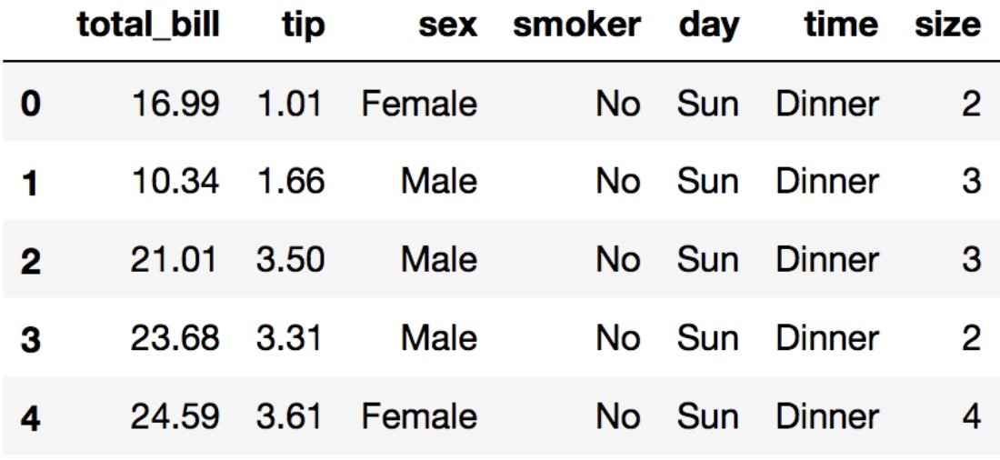
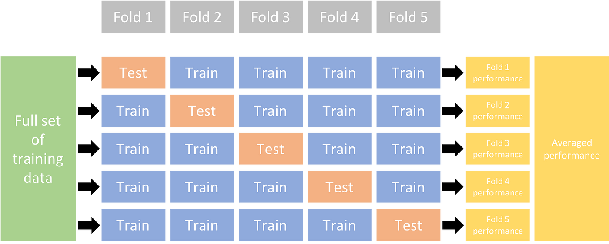

# Common Terminology

### Training Dataset

The **training dataset** is the part of the overall dataset that is used to train the model. It contains the input data, its labels, and the target values.

### Testing Dataset

The **testing dataset** is the part of the overall dataset that is used to test the performance of the trained model. This involves using data not seen by the model during training to make predictions and then comparing those predictions to the correct labels.

### Validation Dataset

The **validation dataset** is the part of the overall dataset that is used to fine-tune the model's hyperparameters, select between multiple models or model configurations, as well as to prevent overfitting. You can also use this portion of the dataset to evaluate the model's performance during training.

### Ground Truth

**Ground truth** refers to the actual labels or target values of the dataset, used to compare the model's predictions to the correct answers and evaluate prediction accuracy.

### Label/Target

The **label** or **target** is the value that the model is predicting.

### Pre-processing

**Pre-processing** involves preparing the data for model training. This step is crucial for shaping the data into a suitable format, especially when using non-ML-specific datasets.

### Feature

A **feature** is an input to the machine learning algorithm. This is typically a column in a 2D dataset.

### Data point

A **data point** is a collection of features that represents a full input to a model. This is typically a row in a 2D dataset.

### Numerical

**Numerical** data points can be counted (e.g., quantitative data like horsepower in a car, or weight in a person).

### Nominal

**Nominal** data points cannot be counted (e.g., qualitative data like color).

In the example dataset above, **total_bill**, **tip** and **size** are numerical features, while **sex**, **smoker**, **day**, and **time** are nominal features. Row **0** is a data point. Your target, however, will change depending on what you want to predict. If you wanted to create a model which predicted how much a person would tip based on the data above, **tip** would be your **target**.

### Decision Surface

The **decision surface** in a classification model is the boundary that distinguishes between different classes. It's the separator between the orange and blue sections in this graph. Some classification models learn to distinguish between classes by drawing a hyperplane (that line, but in >2 dimensional space) to separate out different classes. These models then use these hyperplanes to make predictions about which data points belong to which classes.

### Model Validation

**Model validation** assesses a trained model's performance on unseen data, using metrics like accuracy, f1 score, recall, etc.

### True Positives (TP)

The instances correctly predicted as positive.

### True Negatives (TN)

The instances correctly predicted as negative.

### False Positives (FP)

The instances incorrectly predicted as positive.

### False Negatives (FN)

The instances incorrectly predicted as negative.

### Error (ERR)

Shows you how often the model gets a prediction wrong.

$$
    \text{ERR} = \frac{\text{FP} + \text{FN}}{\text{FP} + \text{FN} + \text{TP} + \text{TN}} = 1 - \text{ACC}
$$

### Accuracy (ACC)

**Accuracy** represents the proportion of correctly predicted items to the total number of predictions made.

$$
    \text{ACC} = \frac{\text{TP} + \text{TN}}{\text{FP} + \text{FN} + \text{TP} + \text{TN}} = 1 - \text{ERR}
$$

### Precision (PRE)

The ratio of true positive predictions to the total number of positive predictions (including both true positives and false positives). It answers the question, "Of all instances classified as positive, how many are actually positive?"

$$
    \text{PRE} = \frac{\text{TP}}{\text{TP} + \text{FP}}
$$

### Recall (REC)

##### (Sensitivity/True Positive Rate)

The ratio of true positive predictions to the total number of actual positive instances (including both true positives and false negatives). It answers the question, "Of all actual positive instances, how many are correctly classified by the model?"

$$
    \text{REC} = \frac{\text{TP}}{\text{TP} + \text{FN}}
$$

### True Negative Rate (TNR)

##### (Specificity)

This is the proportion of true negatives out of the total number of negatives. It aims to tell you the same thing recall tells you about true positives, but about true negatives. This would be useful in a situation where false positives have a significant cost, such as a system which tries to identify nuclear attacks. It is calculated as:

$$
    \text{REC} = \frac{\text{TN}}{\text{TN} + \text{FP}}
$$

### F1 Score

The **F1 score** is a statistical measure which balances the trade-off between precision and recall. It is particularly useful in scenarios where an equal importance is given to both false positives and false negatives, or when dealing with _imbalanced datasets_. The F1 score is the harmonic mean of precision and recall, providing a single metric that accounts for both the false positives and false negatives in the model's predictions.

$$
    \text{F1} = 2*\frac{\text{PRE} \times \text{REC}}{\text{PRE} + \text{REC}}
$$

### Receiver Operating Characteristic

This is the ratio of the TPR to the FPR. It is typically represented as a curve with TPR plotted on the y-axis and FPR plotted on the x-axis. A model that classifies things at random will show up as a diagonal line across this plot. A good classifier will hug the top left portion of the graph, indicating that it has a high true positive rate, and a low false positive rate. Likewise, a poor curve will be the inverse of this with a high false positive rate, and a low true positive rate. It is calculated as:

$$
    \text{ROC} = \frac{\text{TPR}}{\text{FPR}}
$$

### AUC

##### (Area under the [Receiver Operating Characteristic] curve)

This is a quantitative measurement of the overall performance of the classifier using the ROC curve. It boils the ROC curve down to a single value. A higher value here will indicate a better classifier. This would be calculated, in theory, as the definite integral of the ROC curve, however numerically it is approximated using a Reimann sum typically implemented as the trapezoidal rule.

$$
    \text{AUC} = \int_{x=0}^{1} \text{TPR}(x) \, dx
$$

### Cross-validation

**Cross-validation** is a technique for estimating a model's generalizability to new data. It involves testing the model against subsets of data withheld from the training set in order to collect statistics which can then ve averaged to produce a more realistic assessment of the model's overall performance.

### Hyperparameters

**Hyperparameters** are the adjustable settings of a model, like learning rate or gamma, which are tuned between training runs to enhance performance.

### Overfitting

**Overfitting** occurs when a model is trained to perfectly (or too closely) fit the training data, to the detriment of its performance on new, unseen data.

### Regularization

**Regularization** is when you constrain a model to make it simpler in order to reduce the risk of overfitting to the dataset.